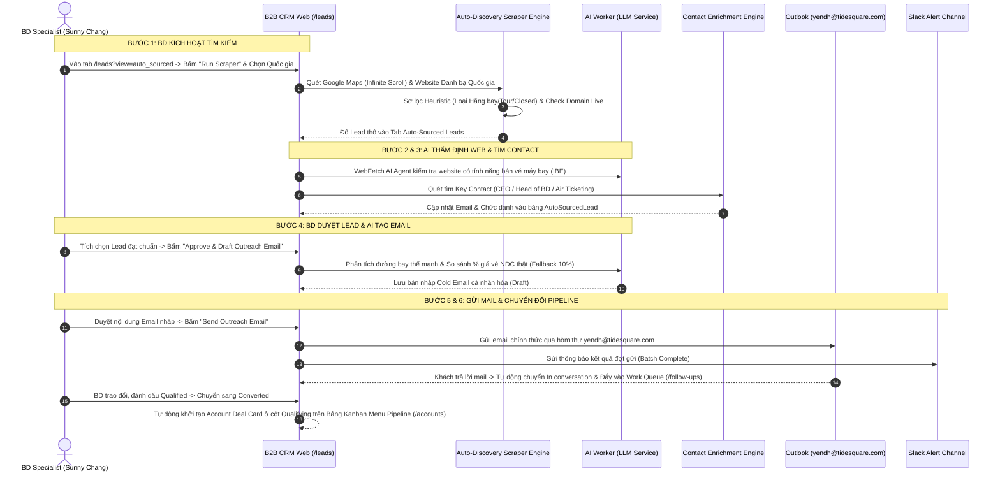

# 📘 TÀI LIỆU YÊU CẦU SẢN PHẨM (PRD)
## TÍNH NĂNG: AI-POWERED OUTREACH & CONTACT ENRICHMENT (PHASE 1)
**Dự án:** B2B CRM System - Tidesquare BD  
**Tác giả:** Phương Huyền  
**Ngày khởi tạo:** 10/09/2026 (Cập nhật mới nhất: 23/09/2026)  

### 🔗 TÀI NGUYÊN HỆ THỐNG & ĐỊA CHỈ TRUY CẬP (DEMO CREDENTIALS)
* **Website:** [https://crm-system.haiyen0710.workers.dev/login](https://crm-system.haiyen0710.workers.dev/login)
* **Tài khoản đăng nhập (Account):** `yendh`
* **Mật khẩu (Password):** `tidesquare01`
* **Tài liệu Hướng dẫn Giao diện CRM:** [`b2b_crm.md`](https://github.com/TIDESQUARE/huyendp/blob/main/crm_b2b.md/b2b_crm.md)

---

## 1. TỔNG QUAN DỰ ÁN (BUSINESS OVERVIEW)

### 1.1. Bối cảnh & Bản chất Hợp tác B2B (Partnership Context & Core Offer)
Đội ngũ Business Development (BD) của Tidesquare hiện đang thực hiện chiến dịch tiếp cận (Outreach) tới các Đại lý du lịch, Công ty lữ hành và Đại lý vé máy bay (Agencies) tại thị trường Châu Á - Đông Nam Á nhằm chào mời **Hợp tác phân phối sản phẩm Air Content & Chuẩn kết nối NDC (New Distribution Capability) qua Nền tảng HaloSync**.

#### 🤝 Bản chất Mô hình Hợp tác giữa Tidesquare & Agency:
1. **Vai trò của Tidesquare / HaloSync:**
   * Tidesquare đóng vai trò là **Nhà cung cấp Hạ tầng Công nghệ & Gom nguồn vé Hàng không (Air Content & NDC Aggregator Platform)**.
   * Tidesquare kết nối sẵn API chuẩn NDC của hàng chục hãng hàng không lớn trên thế giới (Vietnam Airlines, Thai Airways, Vietjet, Singapore Airlines, FSCs & LCCs) vào hệ thống **HaloSync**.
2. **Vai trò của Agency (Đối tác):**
   * Agency đóng vai trò là **Đơn vị phân phối bán vé máy bay** tới hành khách cuối cùng (B2C) hoặc đóng gói thành các Tour du lịch trọn gói.
3. **Nội dung hợp tác cụ thể (Cái Tidesquare cung cấp cho Agency):**
   * **Nguồn vé giá gốc NDC (Rẻ hơn ~10% so với GDS):** Giúp Agency tiếp cận kho vé máy bay chuẩn NDC với giá cạnh tranh hơn khoảng 10% so với mua qua kênh truyền thống GDS (như Sabre/Amadeus) và **hoàn toàn không bị mất phí phụ thu trung gian (Zero GDS Surcharge)**.
   * **Công cụ vận hành xuất vé (Ticketing Operations Engine):** Cung cấp cho Agency cổng Web Portal (Luna) để tra cứu/đặt/xuất vé tập trung, hoặc cấp API (PolarHub) để Agency cắm thẳng nguồn vé HaloSync vào Website/App riêng của họ.

---

### 1.2. Thách thức hiện tại của BD (Current Challenges)

#### Các điểm nghẽn của BD khi đi chào hợp tác:
1. **Thiếu thông tin người quyết định:** Đa phần dữ liệu agency chỉ có email chung (`info@`, `sales@`), khiến đề xuất hợp tác NDC không tới được đúng người có thẩm quyền (CEO, Head of BD/Flight).
2. **Email thiếu tính cá nhân hóa:** Đang sử dụng 1 mẫu email chào hàng dùng chung, chưa nhấn mạnh được chặng bay / hãng hàng không thế mạnh phù hợp với từng agency.
3. **Thao tác thủ công:** Quá trình tìm kiếm contact, soạn email và cập nhật trạng thái trên Web CRM tốn nhiều thời gian của BD.

---

## 2. CHÂN DUNG NGƯỜI DÙNG & LUỒNG CÔNG VIỆC (USER FLOW)

### 2.1. User Persona
* **Nhân vật chính:** BD Specialist / BD Lead — **Chị Sunny Chang** (Director, Global Business Development).
* **Hành vi:** Tạo chiến dịch tiếp cận theo thị trường, duyệt bản nháp email do AI soạn, theo dõi phản hồi và đàm phán hợp đồng.

### 2.2. Luồng công việc tổng thể & Hành động của BD (End-to-End Workflow & BD Actions)

#### 📝 Tóm tắt Hành động của BD (Người dùng Web) theo từng bước:
1. **Bước 1 (Kích hoạt Sourcing):** BD truy cập Tab `Auto-Sourced Leads` (`/leads?view=auto_sourced`), bấm nút **"Run Scraper & Auto Find"**, chọn Quốc gia mục tiêu (vd: Thailand) và bấm **"Start Pipeline"**.
2. **Bước 2 & 3 (AI & Bot xử lý ngầm):** Hệ thống tự cào Google Maps, lọc rác, thẩm định website có bán vé máy bay hay không và tự động tìm Email người quyết định (CEO/Head of BD). BD theo dõi kết quả tự động xuất hiện trên màn hình CRM.
3. **Bước 4 (Duyệt Lead & Tạo Email):** BD xem danh sách Lead hợp lệ tại Tab `Auto-Sourced Leads`, chọn các Agency mong muốn và bấm **"Approve & Draft Outreach Email"**. AI sẽ cào giá vé thực tế, tính % tiết kiệm (hoặc giữ 10%) và soạn bản nháp Email (Draft).
4. **Bước 5 (Gửi Email & Theo dõi Phản hồi):** BD xem qua bản nháp Email, bấm **"Send Outreach Email"** để gửi qua Outlook (`yendh@tidesquare.com`). Khi khách phản hồi, trạng thái tự chuyển sang **`In conversation`** và đẩy mail vào hòm **Work Queue (`/follow-ups`)**.
5. **Bước 6 (Chuyển đổi Pipeline):** Sau khi BD trao đổi, nếu BD đánh giá đạt chuẩn ➔ chọn **`Qualified`**. Khi BD chốt hợp tác và chuyển trạng thái sang **`Converted`**, hệ thống mới **TỰ ĐỘNG KHỞI TẠO 1 DEAL CARD** tại cột `Qualifying` trên Bảng Kanban Board của **Menu Pipeline (`/accounts`)**.

#### 🔄 Sơ đồ Sequence Flow chi tiết:



---

## 3. YÊU CẦU CHỨC NĂNG CHI TIẾT (FUNCTIONAL REQUIREMENTS)

### 3.1. FEATURE 1: AI AUTO-DISCOVERY & LEAD QUALIFICATION ENGINE (Tự động Tìm kiếm & Thẩm định Lead Agency)

#### A. Mục tiêu & Nguyên lý Hoạt động
Tính năng này tự động hóa 100% quy trình thu thập và sàng lọc đối tác Agency tiềm năng thông qua **Phễu xử lý tự động 4 bước (Multi-Stage Processing Pipeline)**:

1. **Bước 1: Thu thập Dữ liệu Đa nguồn (Tích hợp module [`google-maps-scraper`](https://github.com/TIDESQUARE/huyendp/tree/main/crm_b2b.md/google-maps-scraper) & National Directory Scraper):** 
   - Hệ thống tự động khởi chạy Query tìm kiếm theo Quốc gia (`[Mã sân bay] travel agency`, `[Thành phố] flight ticketing agency`).
   - Tích hợp module **`google-maps-scraper`** với cơ chế **Auto-Scroll Infinite Results & Pagination Wait** để cuộn trang liên tục đến khi thu thập toàn bộ danh sách đối tác trên Google Maps (trích xuất 34 thuộc tính dữ liệu thô). Nếu quốc gia mục tiêu có danh bạ lữ hành chính thức (như ATTA Thái Lan), hệ thống ưu tiên quét dữ liệu từ danh bạ trước.
2. **Bước 2: Lọc rác & Kiểm tra Trạng thái Hoạt động (Heuristic Filter & Status Check):**
   - Loại bỏ các cơ sở báo **Permanently Closed** trên Google Maps hoặc tên miền không khả dụng (**Lỗi HTTP 404 / Expired Domain**).
   - Loại bỏ các đối tượng không thuộc nhóm khách hàng mục tiêu: Hãng hàng không (nguồn cung), công ty tour thuần túy, đại lý Visa/SIM/WiFi, khách sạn, trang tin tức du lịch.
3. **Bước 3: Thẩm định Chuyên sâu bằng AI Agent (AI WebFetch Agent & Playwright):**
   - AI Agent tự động truy cập từng website đã qua lọc rác để phân tích nội dung thực tế và xác minh tiêu chí: *"Website có cung cấp tính năng tìm kiếm & đặt vé máy bay trực tuyến (Flight Ticketing / OTA Engine) hay không?"*. (Đối với website dùng kỹ thuật chặn Bot ➔ Hệ thống kích hoạt Chromium thật qua Playwright để xác minh lại).
4. **Bước 4: Trình bày Danh sách Lead Đạt tiêu chuẩn (Qualified Lead Output):**
   - Hệ thống chuyển toàn bộ Lead đã qua thẩm định về **Tab Mới `Auto-Sourced Leads` (`/leads?view=auto_sourced`)** tại Menu Agencies trên Web CRM. BD chỉ cần xem danh sách đã chuẩn hóa, lựa chọn đối tác phù hợp và bấm *"Approve to Campaign"*.

---

### 3.2. FEATURE 2: AI CONTACT KEY ENRICHMENT (Tìm kiếm người quyết định & Ngữ cảnh doanh nghiệp)

#### A. Quy tắc ưu tiên chức danh (Job Title Priority Rules)

| Cấp độ ưu tiên | Nhóm Chức danh (Job Titles) | Mô tả vai trò |
| :--- | :--- | :--- |
| **Tier 1 (Ưu tiên cao nhất)** | CEO, Founder, Co-Founder, Managing Director, Owner | Người quyết định cao nhất của Agency |
| **Tier 2 (Ưu tiên thứ hai)** | Head of Business Development, Head of Partnerships, BD Director | Người chịu trách nhiệm mở rộng nguồn hàng & đối tác |
| **Tier 3 (Ưu tiên thứ ba)** | Head of Flight, Air Ticketing Manager, Head of Ticketing | Người phụ trách trực tiếp nghiệp vụ vé máy bay |
| **Tier 4 (Fallback)** | Email phòng ban chuyên trách: `partnerships@`, `contracting@`, `b2b@` | Email phòng ban khi không tìm thấy cá nhân |

#### B. Quy tắc nguồn dữ liệu (Data Source Rules)
* **Thông tin Doanh nghiệp (Company Profile):** Ưu tiên quét chính xác từ **Website chính thức của Agency** (lấy mảng kinh doanh, thị trường trọng điểm, hãng hàng không hợp tác).
* **Thông tin Liên hệ (Contact Details):** Quét kết hợp đồng thời trên **Website công ty** (lấy general contact) và **LinkedIn** (lấy email/profile cá nhân).

#### C. Bảng quy tắc nghiệp vụ IF-THEN & Vị trí hiển thị trên Website (BR-01 Log)

| Mã Rule | Điều kiện (IF) | Thao tác hệ thống (THEN) | Vị trí hiển thị trên CRM Web |
| :--- | :--- | :--- | :--- |
| **BR-01.1** | Tìm thấy Email cá nhân thuộc Tier 1 / Tier 2 / Tier 3 | Gán email đó làm `Primary Outreach Email` | **Menu Agencies ➔ Chi tiết Đại lý (`/leads/[id]`):** Tại Tab `Contacts` & Header Bar hiển thị Badge `Tier 1: CEO` hoặc `Tier 2: Head of BD`. |
| **BR-01.2** | Không tìm thấy Email Tier 1-3, nhưng có Email Tier 4 (`partnerships@`) | Gán email Tier 4 làm `Primary Outreach Email` | **Menu Agencies ➔ Chi tiết Đại lý (`/leads/[id]`):** Tại Tab `Contacts` hiển thị Badge `Fallback Department Contact`. |
| **BR-01.3** | Không tìm thấy bất kỳ Email nào trên Web & LinkedIn | Đưa đại lý vào danh sách thiếu contact | **Menu Agencies (`/leads`):** Đưa đại lý vào Tab lọc nhanh `Missing Contact` (`/leads?view=missing_contact`). |
| **BR-01.4** | Email bị nảy / lỗi đường truyền (Bounce Event) | Đánh dấu email hỏng | **Menu Agencies (`/leads`):** Hiển thị Badge `Bad Email` tại cột Status và thông báo tại Tab `Contacts`. |

---

### 3.3. FEATURE 3: AI CUSTOMIZED OUTREACH EMAIL & DYNAMIC MARGIN BENCHMARK (Cá nhân hóa Email chào hàng & So sánh Giá vé Thực tế)

#### A. Mẫu Email chuẩn chưa cá nhân hóa (Original Sample Template)
Mẫu Cold Email chuẩn hiện tại do chị Sunny Chang sử dụng (Đã loại bỏ con số 10% cố định, thay bằng biến so sánh giá thực tế):

```text
Subject: Partnership: NDC flight content for {{agency_name}}

Dear {{greeting_name}},
 
We came across {{agency_name}} while researching agencies active in air ticketing and international travel in {{country}}.
 
Tidesquare is one of South Korea's Tier 1 travel agencies. We built an airline aggregation platform (HaloSync: https://halosync.kr/solutions) to improve our own ticketing margins and simplify how we access airline content, and are now extending it to selected partners in Southeast Asia.
 
As airlines continue to expand their NDC offerings, more competitive fares, richer fare families, and additional content are being distributed outside traditional GDS channels. HaloSync consolidates these sources into a single platform, helping agencies access more competitive pricing and manage airline content more efficiently.
 
In some cases, we've observed fare differences of {{calculated_fare_margin_clause}} between traditional GDS and NDC channels for the same airline and route.
 
Would you be open to a short 15-minute conversation to explore whether this could support your ticketing operations?
 
If there is a colleague responsible for airline distribution, I'd appreciate it if you could point me in the right direction.

Best regards,
Sunny Chang
Director, Global Business Development
Tidesquare | HaloSync
```

#### B. Mẫu Email Cấu hình Thẻ biến động (Personalized Dynamic Framework)
AI sẽ tự động chèn thông tin ngữ cảnh quét được từ Website Agency (ở Feature 1) và con số so sánh giá NDC thực tế vào các vị trí được cá nhân hóa trong email:

```text
Subject: Partnership: NDC flight content for {{agency_name}}

Dear {{greeting_name}},
 
We came across {{agency_name}} while researching agencies active in air ticketing and international travel in {{country}}{{focused_market_or_route_clause}}.
 
Tidesquare is one of South Korea's Tier 1 travel agencies. We built an airline aggregation platform (HaloSync: https://halosync.kr/solutions) to improve our own ticketing margins and simplify how we access airline content, and are now extending it to selected partners in Southeast Asia{{partner_airline_custom_note}}.
 
As airlines continue to expand their NDC offerings, more competitive fares, richer fare families, and additional content are being distributed outside traditional GDS channels. HaloSync consolidates these sources into a single platform, helping agencies access more competitive pricing and manage airline content more efficiently.
 
In some cases, we've observed fare differences of {{calculated_fare_margin_clause}} between traditional GDS and NDC channels for the same airline and route{{route_specific_example}}.
 
Would you be open to a short 15-minute conversation to explore whether this could support your ticketing operations?
 
If there is a colleague responsible for airline distribution, I'd appreciate it if you could point me in the right direction.

Best regards,
Sunny Chang
Director, Global Business Development
Tidesquare | HaloSync
```

#### C. Ví dụ thực tế 1: Email cá nhân hóa cho 12Go Thailand Co., Ltd. (Đại lý chặng Đông Nam Á / LCC & Tour)
```text
Subject: Partnership: NDC flight content for 12Go Thailand Co., Ltd.

Dear Mr. Tan,
 
We came across 12Go Thailand Co., Ltd. while researching agencies active in air ticketing and international travel in Thailand, particularly for popular routes connecting Bangkok with Da Nang and Hanoi.
 
Tidesquare is one of South Korea's Tier 1 travel agencies. We built an airline aggregation platform (HaloSync: https://halosync.kr/solutions) to improve our own ticketing margins and simplify how we access airline content, and are now extending it to selected partners in Southeast Asia, tailored for leading OTAs distributing FSC & LCC content.
 
As airlines continue to expand their NDC offerings, more competitive fares, richer fare families, and additional content are being distributed outside traditional GDS channels. HaloSync consolidates these sources into a single platform, helping agencies access more competitive pricing and manage airline content more efficiently.
 
In some cases, we've observed average fare savings of 14.5% on Bangkok-Da Nang NDC routes between traditional GDS and NDC channels for the same airline and route, especially on Thailand-Vietnam and Korea-Southeast Asia routes.
 
Would you be open to a short 15-minute conversation to explore whether this could support your ticketing operations?
 
If there is a colleague responsible for airline distribution, I'd appreciate it if you could point me in the right direction.

Best regards,
Sunny Chang
Director, Global Business Development
Tidesquare | HaloSync
```

#### D. Ví dụ thực tế 2: Email cá nhân hóa cho Flymya (Đại lý bán vé Hàng không truyền thống FSC)
```text
Subject: Partnership: NDC flight content for Flymya

Dear Ms. Aye,
 
We came across Flymya while researching agencies active in air ticketing and international travel in Myanmar, with a strong focus on regional FSC airline distribution across Asia.
 
Tidesquare is one of South Korea's Tier 1 travel agencies. We built an airline aggregation platform (HaloSync: https://halosync.kr/solutions) to improve our own ticketing margins and simplify how we access airline content, and are now extending it to selected partners in Southeast Asia, specially optimized for full-service carrier NDC integration.
 
As airlines continue to expand their NDC offerings, more competitive fares, richer fare families, and additional content are being distributed outside traditional GDS channels. HaloSync consolidates these sources into a single platform, helping agencies access more competitive pricing and manage airline content more efficiently.
 
In some cases, we've observed fare differences of around 10% between traditional GDS and NDC channels for the same airline and route, particularly for regional FSC long-haul and feeder flights.
 
Would you be open to a short 15-minute conversation to explore whether this could support your ticketing operations?
 
If there is a colleague responsible for airline distribution, I'd appreciate it if you could point me in the right direction.

Best regards,
Sunny Chang
Director, Global Business Development
Tidesquare | HaloSync
```

#### E. Bảng Định nghĩa Thẻ biến Cá nhân hóa & So sánh Giá vé Thực tế (Dynamic Fare & Route Benchmark)

| Mã Thẻ biến | Nguồn dữ liệu quét từ Feature 1 & 2 | Giá trị AI điền cho 12Go Thailand | Giá trị AI điền cho Flymya | Rào cản AI & Quy tắc So sánh Giá (Guardrails) |
| :--- | :--- | :--- | :--- | :--- |
| `{{greeting_name}}` | Họ tên Contact Key | `Mr. Tan` | `Ms. Aye` | Nếu không có tên ➔ Điền `Team` |
| `{{country}}` | Quốc gia của Agency | `Thailand` | `Myanmar` | Tên quốc gia chuẩn |
| `{{focused_market_or_route_clause}}` | Thị trường / Chặng bay trọng điểm quét từ Website | `, particularly for popular routes connecting Bangkok with Da Nang and Hanoi` | `, with a strong focus on regional FSC airline distribution across Asia` | **BẮT BUỘC** chỉ liên quan đến đường bay / Air Content. |
| `{{partner_airline_custom_note}}` | Hãng hàng không đối tác agency đang bán | `, tailored for leading OTAs distributing FSC & LCC content` | `, specially optimized for full-service carrier NDC integration` | Phân loại: Agency nhiều hãng FSC vs ít hãng/LCC để cá nhân hóa thông điệp hợp tác. |
| `{{calculated_fare_margin_clause}}` | API Benchmark giá vé HaloSync NDC so với GDS công cộng | `observed average fare savings of 14.5% on Bangkok-Da Nang NDC routes` | `observed fare differences of around 12% on regional FSC routes` | **DYNAMIC FARE BENCHMARK:** AI tự động gọi API so sánh giá thật theo đường bay thế mạnh. **QUY TẮC FALLBACK:** Nếu không cào/tính được giá cụ thể ➔ AI sẽ giữ nguyên con số **10% cố định** (`around 10%`). |

#### F. Quy định Giao diện & Các Nút Thao tác trên CRM (UI Controls: Menu Campaigns ➔ Chọn 1 Campaign ➔ Tab Drafts)

Vì hệ thống hiện tại **kết nối trực tiếp qua Microsoft Graph API với hòm thư đại diện của chị Hải Yến (`yendh@tidesquare.com`)**, chị Sunny Chang sẽ **tự mở ứng dụng Outlook cá nhân (`sunnychang@tidesquare.com`) để gửi mail thủ công tới Agency và BẮT BUỘC luôn CC cho hòm thư chị Hải Yến (`yendh@tidesquare.com`)**. 

🤖 **CƠ CHẾ TỰ ĐỘNG CHUYỂN TRẠNG THÁI (AUTO SENT SYNC):**  
Ngay khi chị Sunny phát lệnh gửi mail bên ứng dụng Outlook (có CC chị Yến), Bot ngầm của CRM sẽ **tự động quét thấy bức mail này trong hòm thư `yendh@tidesquare.com` ➔ Hệ thống TỰ ĐỘNG ĐỔI TRẠNG THÁI BẢN NHÁP SANG `SENT`**, tự động ẩn item khỏi Tab `Drafts` và chuyển nhật ký sang Tab `Activity`. **BD KHÔNG CẦN BẤM BẤT KỲ NÚT ĐÁNH DẤU THỦ CÔNG NÀO TRÊN CRM (`Mark email sent manually` bị ẩn/loại bỏ để tránh thao tác thừa).**

Tại giao diện Xem & Duyệt bản nháp (**Menu `Campaigns` ➔ Click chọn 1 Campaign cụ thể ➔ Chọn Tab `Drafts`** / màn hình `Generate & review drafts`), hệ thống quy định các nút thao tác như sau:

1. **Các nút Copy Nhanh (Quick Copy Controls - Thao tác chính):**
   * **Icon Copy tại ô Address / Subject / Content:** Cho phép BD bấm 1-click để copy nhanh địa chỉ, tiêu đề và nội dung email đã được AI cá nhân hóa để dán sang ứng dụng Outlook cá nhân gửi.
2. **Nút `Regenerate AI Draft` (Tạo lại Email Customize / Re-run AI):**
   * **Vị trí:** Góc trên bên phải khung xem nội dung Email.
   * **Nghiệp vụ:** Khi BD đọc bản nháp AI soạn sẵn nhưng **chưa ưng ý** (muốn đổi tone giọng hoặc chạy lại dữ liệu cào chặng bay mới), BD bấm nút này ➔ AI Worker sẽ cào/phân tích lại ngữ cảnh và sinh ra bản nháp mới cá nhân hóa tốt hơn.
3. **Nút `Save edits` (Lưu nội dung chỉnh sửa thủ công):**
   * **Nghiệp vụ:** Cho phép BD tự tay chỉnh sửa văn bản trực tiếp trong ô `Subject` hoặc `Content` rồi bấm `Save edits` để lưu lại trước khi copy sang Outlook gửi.

---

### 3.4. FEATURE 4: AUTO-SYNC STATUS VIA OUTLOOK EMAIL (yendh@tidesquare.com) & PIPELINE CONVERSION

#### A. Vị trí Trình bày & Hiển thị Trạng thái trên Giao diện Web CRM (UI Location Mapping)

Trạng thái của Agency sẽ được kết nối và đồng bộ trực tiếp qua Microsoft Graph API Webhook với hòm thư Outlook chính thức: **`yendh@tidesquare.com`**. Trạng thái được trình bày cụ thể tại các vị trí sau trên Website:

1. **Menu Agencies (`/leads` - Bảng danh sách chính):**
   * **Cột `Status`:** Hiển thị Badge màu sắc tương ứng (`New` - Xám, `Contacted` - Xanh dương, `In conversation` - Cam, `Qualified` - Xanh lá, `Unqualified` - Đỏ, `Converted` - Tím).
   * **Các Tab lọc nhanh (Quick Tabs):** `All`, `Active conversations` (`In conversation`), `Needs follow-up`, `Missing contact`.
2. **Menu Agencies ➔ Trang Chi tiết Agency (`/leads/[id]`):**
   * **Header Bar:** Hiển thị Badge trạng thái nổi bật ở đầu trang kèm theo Đếm ngược lịch hẹn follow-up.
   * **Sidebar Panel (Khung cập nhật nhanh bên phải):** Nơi chứa Dropdown danh sách trạng thái, **Ô nhập Ghi chú (Note Input)** và nút `Save status` để BD đổi thủ công & lưu lý do (Ví dụ khi chuyển sang `Unqualified` ➔ BD nhập Note: *"Từ chối hợp tác - Đã có đối tác NDC khác"*).
   * **Tab Activity:** Lưu vết lịch sử thay đổi trạng thái kèm Ghi chú (Note) và thời gian tự động đồng bộ từ Outlook.
3. **Menu Work Queue (`/follow-ups` - Hòm thư làm việc):**
   * **Cột bên trái (Queue List):** Hiển thị Tag trạng thái xử lý (`In conversation`, `Needs sales`, `Waiting agency`).
   * **Cột bên phải (Detail Workspace):** Header hiển thị nhãn lượt hành động (`Sales owns next action` / `Agency owns next action`).
4. **Menu Pipeline (`/accounts` - Bảng Phễu Hợp đồng Kanban):**
   * **Chỉ xuất hiện khi Agency đạt trạng thái `Converted`:** Thẻ tài khoản đối tác sẽ tự động được hệ thống khởi tạo và xuất hiện dưới dạng một Card tại cột `Qualifying` trên Bảng Kanban Board.

#### B. Bảng Quy tắc Chuyển Trạng thái Tự động qua Outlook (BR-03 Log)

| Trạng thái ban đầu | Sự kiện kích hoạt (Outlook / CRM) | Trạng thái mới (New Status) | Vị trí Tác động Tự động trên Web CRM |
| :--- | :--- | :--- | :--- |
| **New** | BD phát lệnh gửi email chào hàng từ Campaign / Outlook | **Contacted** | Chuyển Badge thành `Contacted` ở cột Status tại Menu Agencies (`/leads`) và trang `/leads/[id]`. |
| **Contacted** | Agency gửi email phản hồi lại hòm thư BD `yendh@tidesquare.com` | **In conversation** | Chuyển Badge thành `In conversation`, tự động đẩy mail vào hòm **Work Queue (`/follow-ups`)**. |
| **Contacted / In conversation** | Agency từ chối (Not interested) hoặc BD chọn Unqualified | **Unqualified** | Chuyển Badge thành `Unqualified`, mở ô nhập Note lý do từ chối tại Sidebar Panel trang `/leads/[id]`. |
| **Contacted / In conversation** | BD đánh dấu Category "Qualified" trên Outlook hoặc CRM | **Qualified** | Chuyển Badge thành `Qualified` tại Menu Agencies (`/leads`). |
| **Qualified** | BD chuyển trạng thái agency sang **Converted** | **Converted** | **TỰ ĐỘNG CHUYỂN AGENCY SANG MENU PIPELINE (`/accounts`):** Hệ thống tự động khởi tạo 1 Thẻ tài khoản cơ hội (Account Deal Card) ở cột `Qualifying` trên Bảng Kanban Board của **Menu Pipeline (`/accounts`)**. |
| **Bất kỳ** | Hòm thư nhận mail báo lỗi đường truyền (Delivery Failed / Bounce) | **Missing Contact / Bad Email** | Đổi badge thành `Bad Email`, tự động chuyển Agency vào Tab lọc `Missing Contact` (`/leads?view=missing_contact`). |

#### C. Quy định Cải tiến Giao diện & Quy tắc Chuyển hướng Điều hướng (UI Refactoring & Navigation Behavior at Feature 4)

Để đảm bảo dữ liệu đồng bộ thời gian thực từ hòm thư Outlook về hệ thống B2B CRM được hiển thị chính xác và không bị ngược logic UX tại giao diện **Menu `Campaigns` ➔ Chọn 1 Campaign cụ thể**, hệ thống quy định các cải tiến cụ thể như sau:

1. **Đồng bộ Chỉ số đếm thời gian thực (Campaign Header Metrics Bar):**
   * Các chỉ số **`DRAFTS`**, **`SENT`**, **`REPLIES`** ở đầu trang phải tự động nhảy số theo thời gian thực (Real-time) từ hòm thư Outlook:
     * `DRAFTS`: Đếm số bản nháp **chưa gửi**.
     * `SENT`: Số mail chào hàng đã phát đi thành công từ Outlook.
     * `REPLIES`: Số Agency đã gửi email phản hồi lại (ví dụ: thực tế có 5 khách trả lời ➔ hiển thị `REPLIES: 5`).

2. **Quy tắc làm sạch & Di chuyển Dữ liệu tại Tab `Drafts` (Tab Cleanup & Migration):**
   * **Tab `Drafts` CHỈ CHỨA CÁC BẢN NHÁP CHƯA GỬI.**
   * **Loại bỏ hoàn toàn nhãn tĩnh `Ready to copy`** cho các email đã phát đi hoặc đã có phản hồi. Đối với bản nháp chưa gửi ở Tab `Drafts`, hiển thị nhãn động **`Draft Ready`** (Xám/Xanh nhạt).
   * Loại bỏ hoàn toàn sub-tab `Sent` nằm bên trong Tab `Drafts` (tránh mâu thuẫn ngữ nghĩa UX).
   * Ngay khi mail được phát đi (`Sent` - qua nút gửi hoặc Outlook API), item đó **TỰ ĐỘNG ẨN KHỎI Tab `Drafts`** và toàn bộ nhật ký gửi mail **TỰ ĐỘNG CHUYỂN SANG VÀ LƯU VẾT TẠI TAB `Activity`** (Step 5: Tracking & follow-up).
   * *(Lưu ý: Các nút bấm thao tác tạo lại nháp `Regenerate AI Draft` và phát lệnh gửi `Send Email via Outlook` đã được định nghĩa tại Feature 3 - Mục 3.3.F).*

3. **Chuẩn hóa Giao diện Tab `Activity` (Step 5: Tracking & Follow-up):**
   * Là nơi quản lý các Agency **ĐÃ ĐƯỢC GỬI MAIL** (`Sent`), **ĐÃ REPLY** (`Replied / In conversation`) hoặc **BỊ NẢY MAIL** (`Bounced`).
   * Thay thế hiển thị chữ xám đơn điệu bằng các Badge màu sắc động: **`SENT`** (Xanh dương), **`REPLIED`** (Cam/Neon), **`BOUNCED`** (Đỏ).

4. **Quy tắc Chuyển hướng Điều hướng khi Click vào Lượt tương tác (Navigation Behavior Rules):**
   * Khi BD click vào tên Agency hoặc dòng `Latest touch` tại Tab `Activity` (hoặc tại danh sách Campaign):
     * **Nếu Agency ĐÃ REPLY (`Replied` / `In conversation`):** Hệ thống **REDIRECT trực tiếp sang Tab `Active Conversations` của Menu `Work Queue` (`/follow-ups?view=active_conversations&leadId=...`)** — nơi có sẵn khung đọc mail, nút reply và đổi trạng thái tập trung để BD làm việc liền mạch.
     * **Nếu Agency CHƯA REPLY (Mới dừng ở trạng thái `Sent`):** Hệ thống **REDIRECT sang Tab `No Reply Yet` của Menu `Work Queue` (`/follow-ups?view=no_reply_yet&leadId=...`)** (hoặc mở Sidebar xem lại bức mail chào hàng đã gửi).

---

### 3.5. FEATURE 5: BÁO CÁO & CẢNH BÁO KẾT QUẢ OUTREACH QUA KÊNH SLACK ALERT (Slack Notification Integration)

#### A. Chiến lược Tối ưu Cảnh báo Slack (Anti-Noise Slack Strategy)
Để tránh hiện tượng dội tin nhắn ngập tràn (Spam/Noise Slack) cho đội ngũ BD, hệ thống áp dụng cơ chế phân loại sự kiện bắn Slack nghiêm ngặt dựa trên mode gửi (Manual vs Batch) và tính chất quan trọng của sự kiện:

| Thao tác BD / Sự kiện | Có bắn Slack không? | Tần suất & Luồng xử lý | Lý do thiết kế |
| :--- | :--- | :--- | :--- |
| **BD gửi thủ công 1 email trên Web** | ❌ **KHÔNG** | Không bắn tin nhắn Slack | BD vừa thao tác trực tiếp trên giao diện Web CRM và đã nhận thông báo Toast `Sent successfully`. |
| **Hoàn thành Batch Job (Gửi/Enrich hàng loạt)** | ✅ **CÓ (🟢 INFO)** | **1 tin duy nhất** sau khi kết thúc toàn bộ Batch | Chuẩn hóa theo format RPA Hàn Quốc (*RPA 처리 봇*). Tổng kết tổng số, thành công, thất bại của cả chiến dịch. |
| **Khách hàng Reply / Click Link Demo** | ✅ **CÓ (🔥 HOT LEAD)** | **Realtime ngay lập tức** | Cơ hội bán hàng vàng! Báo cho BD vào chốt Demo / đặt lịch tư vấn gấp. |
| **Tổng kết cuối ngày (Daily Digest)** | ✅ **CÓ (📊 SUMMARY)** | **1 tin duy nhất vào 17:30 mỗi ngày** | Gom toàn bộ số liệu gửi mail thủ công & tương tác trong ngày để BD/Manager nắm tổng quan. |
| **Lỗi hệ thống Critical (Hết Quota / Mất kết nối API)** | ✅ **CÓ (🔴 ERROR)** | **Realtime khi xảy ra lỗi** (Có Throttling - chỉ báo 1 lần/lỗi) | Cảnh báo Admin nâng quota API Hunter/Apollo hoặc đăng nhập lại kết nối Outlook MS Graph API. |

---

#### B. Mẫu định dạng tin nhắn Slack Alert (Slack Notification Templates - English Standard)

##### 1. Tin nhắn báo cáo hoàn thành Batch Job (Batch Execution Info - 🟢):
```text
🟢 CRM AI Outreach Bot (INFO)
Execution Process : B2B_CRM_001_Campaign_Enrich_And_Draft_Process
Execution Status  : COMPLETED
Execution Time    : 2026-09-11 10:48:15
Campaign Name     : Thailand_Outreach_Q3 (ID: cmrfz5d6g0003p1pe4e7rlla3)
Message           : Batch Job Execution Completed Successfully
Total Agencies    : 50
Success (Draft Generated) : 42
Failed (Missing Contact)  : 8
```

##### 2. Tin nhắn Hot Lead Alert - Khi agency Phản hồi Email (🔥 HOT LEAD ALERT - 🟢):
```text
🔥 CRM AI Outreach Bot (HOT LEAD ALERT)
Execution Process : B2B_CRM_002_Lead_Response_Tracker
Execution Time    : 2026-09-11 14:20:10
Agency Name       : 12Go Thailand Co., Ltd.
Contact Person    : Mr. Tan (Head of Ticketing)
Trigger Event     : Agency Responded to Cold Email
Required Action   : BD Lead / Sunny Chang please check Work Queue at /follow-ups to handle the response.
```

##### 3. Tin nhắn tổng kết hoạt động hàng ngày (Daily Summary Digest - 📊):
```text
📊 B2B CRM OUTREACH DAILY SUMMARY (17:30)
Execution Time    : 2026-09-11 17:30:00
Total Emails Sent Today : 12 emails (Manual: 7, Batch: 5)
Emails Opened           : 6 agencies
Emails Responded        : 2 agencies (12Go Thailand, Flymya)
Emails Bounced/Failed   : 0
```

##### 4. Tin nhắn báo lỗi sự kiện khẩn cấp (Critical Error Alert - 🔴):
```text
🔴 CRM AI Outreach Bot (ERROR ALERT)
Execution Process : B2B_CRM_001_Campaign_Enrich_And_Draft_Process
Execution Status  : FAILED / ERROR
Execution Time    : 2026-09-11 11:15:02
Error Message     : Enrichment API Quota Exceeded (Apollo API Error 429)
Issue Detail      : 100% of monthly API quota has been consumed. Auto contact enrichment paused.
Required Action   : System Admin please review and upgrade API quota at /runner.
```

---

## 4. KỊCH BẢN KIỂM THỬ TÍNH NĂNG (ACCEPTANCE CRITERIA - GHERKIN SYNTAX)

### Scenario 1: AI tìm đúng Contact Key và hiển thị đúng vị trí trên Web
```gherkin
Given BD import một Agency mới "Kaotours" với website "kaotours.com"
When Hệ thống kích hoạt tính năng AI Contact Enrichment
Then AI quét thấy LinkedIn của ông Founder & Email `ceo@kaotours.com`
And Tại Menu Agencies -> Chi tiết Đại lý `/leads/[id]`, hệ thống hiển thị Badge `Tier 1: CEO/Founder` ở Tab Contacts
```

### Scenario 2: AI viết Cold Email cá nhân hóa chuẩn cho 12Go Thailand Co., Ltd.
```gherkin
Given Agency "12Go Thailand Co., Ltd." có tập trung bán chặng bay Bangkok - Đà Nẵng / Hà Nội
When BD yêu cầu AI tạo nháp email chào hàng
Then AI sinh bản nháp đầy đủ dưới 150 từ, chèn đúng tên Mr. Tan và đề cập chặng Bangkok-Đà Nẵng/Hà Nội
And Email KHÔNG chứa các thông tin ngoài ngành hàng không / NDC
```

### Scenario 3: BD chuyển trạng thái Unqualified kèm Ghi chú lý do
```gherkin
Given BD đang mở trang Chi tiết Đại lý Kaotours tại `/leads/[id]`
When BD chọn trạng thái `Unqualified` ở Sidebar Panel và nhập Note "Từ chối hợp tác - Đã có đối tác NDC"
Then Hệ thống cập nhật trạng thái thành `Unqualified`
And Lưu vết lịch sử kèm Note "Từ chối hợp tác - Đã có đối tác NDC" tại Tab Activity
```

### Scenario 4: Tự động chuyển Agency sang Menu Pipeline khi Converted
```gherkin
Given Agency "12Go Thailand Co., Ltd." đang ở trạng thái `Qualified`
When BD chuyển trạng thái Agency sang `Converted`
Then Hệ thống tự động đổi trạng thái thành `Converted` tại Menu Agencies (`/leads`)
And Tự động tạo 1 Card "12Go Thailand Co., Ltd." ở cột Qualifying tại Menu Pipeline (`/accounts`)
```

### Scenario 5: Tự động bắn thông báo kết quả chạy Batch Job hoặc Hot Lead lên Kênh Slack Alert
```gherkin
Given Kênh Slack Alert `#b2b_crm_ai_bot_alert` đã tích hợp Webhook
When BD bấm gửi chiến dịch Batch 50 email HOẶC Agency 12Go Thailand phản hồi email chào hàng
Then Hệ thống tự động gửi tin nhắn thông báo dạng `🟢 CRM AI Outreach Bot (INFO)` với thống kê chi tiết HOẶC `🔥 HOT LEAD ALERT` báo có phản hồi
And BD có thể kiểm tra báo cáo tức thì trên máy tính hoặc điện thoại thông qua Slack
```

---

## 5. YÊU CẦU PHI CHỨC NĂNG (NON-FUNCTIONAL REQUIREMENTS)

* **Hiệu năng (Performance):** Tốc độ quét thông tin và sinh bản nháp email không quá **10 giây / Agency**.
* **Độ tin cậy AI (AI Safety & Compliance):** 100% email nháp phải nằm ở trạng thái `Draft Ready` để BD duyệt trước khi gửi, tránh việc AI tự động gửi thông tin sai lệch.
* **Bảo mật & Tích hợp (Security & Integrations):** Kết nối Microsoft Graph API tuân thủ tiêu chuẩn xác thực Azure AD và Slack Webhook Bot của Tidesquare.


---

## 6. HƯỚNG DẪN KỸ THUẬT CHO DEVELOPER (DEV HANDOFF SPECIFICATIONS)

### 6.1. Cấu trúc CSDL Đề xuất (Database Schema - Prisma / PostgreSQL)

> **📌 Ghi chú giải thích nghiệp vụ (Non-tech Summary):**  
> Mục này đóng vai trò như bản vẽ thiết kế một **Sheet dữ liệu Excel MỚI tên là `AutoSourcedLead`** trên CSDL. Sheet này dùng riêng để chứa các Lead agency do Bot cào tự động về (gồm các cột: Tên Agency, Website, Quốc gia, Điểm Google Maps, Cờ đánh dấu có bán vé máy bay không, và Cờ phê duyệt) trước khi chị Sunny (BD) chuyển họ sang danh sách quản lý chính. Dev Backend chỉ cần dựa vào mã `Prisma Schema` dưới đây để tạo bảng:

```prisma
// Thêm Enum xác định nguồn Lead
enum SourcingSource {
  GOOGLE_MAPS
  NATIONAL_DIRECTORY
  MANUAL_IMPORT
}

// Bảng lưu thông tin Lead cào tự động chưa qua phê duyệt
model AutoSourcedLead {
  id              String         @id @default(cuid())
  name            String
  domain          String         @unique
  country         String
  city            String?
  address         String?
  phone           String?
  rating          Float?
  source          SourcingSource @default(GOOGLE_MAPS)
  gmapsStatus     String?        // OPERATIONAL | PERMANENTLY_CLOSED
  isDomainLive    Boolean        @default(true)
  isFlightAgency  Boolean        @default(false) // Verified by AI WebFetch
  tier            Int?           // Tier 1, 2, 3, 4
  approvedToLead  Boolean        @default(false)
  createdAt       DateTime       @default(now())
  updatedAt       DateTime       @updatedAt

  @@index([country, isFlightAgency])
}
```

---

### 6.2. Danh sách API Endpoints cần phát triển (API Contracts)

| Method | Endpoint Path | Mô tả chức năng | Request Payload / Params | Response Summary |
| :--- | :--- | :--- | :--- | :--- |
| `POST` | `/api/discovery/start-job` | Kích hoạt con Bot cào dữ liệu theo Quốc gia | `{ country: "thailand", lang: "en" }` | `{ jobId: "job_123", status: "RUNNING" }` |
| `GET` | `/api/leads/auto-sourced` | Lấy danh sách Lead tự động cho Tab `/leads?view=auto_sourced` | `?country=thailand&tier=1` | `{ leads: [...], total: 77 }` |
| `POST` | `/api/leads/approve-bulk` | BD duyệt Lead từ Tab Auto-Sourced chuyển sang Campaign | `{ leadIds: ["id_1", "id_2"] }` | `{ success: true, addedCount: 2 }` |
| `POST` | `/api/benchmark/fare-diff` | Gọi API so sánh giá HaloSync NDC với GDS theo chặng | `{ origin: "BKK", destination: "DAD" }` | `{ marginPercent: 14.5, route: "BKK-DAD" }` |
| `POST` | `/api/integrations/slack/alert` | Phát tin nhắn Webhook Alert lên kênh Slack | `{ type: "BATCH_INFO" \| "HOT_LEAD" \| "ERROR", data: {...} }` | `{ delivered: true }` |

---

### 6.3. Tài nguyên Mã nguồn & Thư mục Bàn giao Kỹ thuật (Resource Repositories & Modules)

Dev team vui lòng tham khảo và tái sử dụng trực tiếp các module mã nguồn sẵn có trong repository:

1. **Source code Web CRM:** [`https://github.com/TIDESQUARE/huyendp/tree/main/crm_b2b.md/crm-system`](https://github.com/TIDESQUARE/huyendp/tree/main/crm_b2b.md/crm-system)
   - Dự án Next.js 14 + Prisma + Cloudflare Workers. 
   - Dev phát triển thêm Tab `/leads?view=auto_sourced` và bảng `AutoSourcedLead` trực tiếp vào source code này.

2. **Bộ công cụ Bot cào dữ liệu Google Maps:** [`https://github.com/TIDESQUARE/huyendp/tree/main/crm_b2b.md/google-maps-scraper`](https://github.com/TIDESQUARE/huyendp/tree/main/crm_b2b.md/google-maps-scraper)
   - Mã nguồn con Bot Golang chuyên dùng để cào dữ liệu Google Maps tự động.
   - Dev **tái sử dụng strực tiếp binary/module này** để thực thi quét dữ liệu theo từng quốc gia, không viết lại Bot cào từ đầu.

3. **Gói Thuật toán & Script Phân loại Lead:** [`https://github.com/TIDESQUARE/huyendp/tree/main/crm_b2b.md/handover-ndc-leadgen`](https://github.com/TIDESQUARE/huyendp/tree/main/crm_b2b.md/handover-ndc-leadgen)
   - **`01-scraper/`:** Cấu hình chạy Google Maps Scraper và hợp đồng 34 cột dữ liệu.
   - **`02-scrape-theo-nuoc/run_country_scrape.py`:** Bộ sinh Search Query tự động theo Quốc gia & Sân bay.
   - **`03-phan-loai-tu-dong/pipeline.py`:** Thuật toán Python 3-Stage lọc rác sơ bộ & tính điểm 0-100 (Tier 1-4).
   - **`04-tieu-chi-NDC-leads/`:** Prompt AI WebFetch Agent deep-dive và script `reverify_browser.py` (Playwright Chromium) để thẩm định xem website có bán vé máy bay online hay không.
   - **`05-ket-qua-hongkong/`:** Bộ dữ liệu kiểm thử mẫu đã chạy thực tế ở Hồng Kông (77 Qualified Leads).

* **Auto-Scroll Timeout:** Đặt `sleep` 1.5s - 2.0s khi gửi sự kiện Scroll Down trên Google Maps để đảm bảo DOM render trọn vẹn kết quả Lazy Loading.
